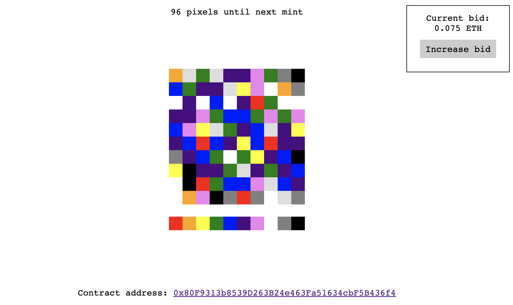

# dAPPlace

dAPPlace.xyz is a decentralised, collaborate, infinite social art game using web3 technology.


[](https://github.com/meyer1994/ipgit/actions/workflows/build.yml)
[](https://github.com/RichardLitt/standard-readme)


## Table of Contents

- [About](#about)
- [Install](#install)
- [Gameplay](#gameplay)
- [Team and Context](#team-and-context)


## About

daPPlace is a canvas for Infinite social art. People can place one colored pixel at a time, collaborating or competing in art battles. An NFT of the current canvas is minted after every 100 changes to the canvas. In parallel, people are bidding to own the NFT while it’s being created. 


## Install

#### Deploy smart contracts

```sh
git clone https://github.com/chris-lovejoy/dAPPlace
cd dAPPlace/hardhat
npm install
npx hardhat compile
npx hardhat run scripts/deploy.js --network <your-network>
```


#### Run backend
```sh
cd server
npm install
node main
```


#### Run front-end

```sh
cd app
npm install
npm run serve
npm run build
npm run lint
```


## Gameplay



## Team and Context
This project was a collaborative effort between:
- Jaoa Meyer
- Chris Lovejoy
- Ali Rizvi
- Ignacio Pastor
- Dave Brewer

This game was initially built as part of the [ETH Amsterdam Hackathon 2022](https://amsterdam.ethglobal.com/index.html) and received prizes from TATUM and IPFS/Filecoin.
